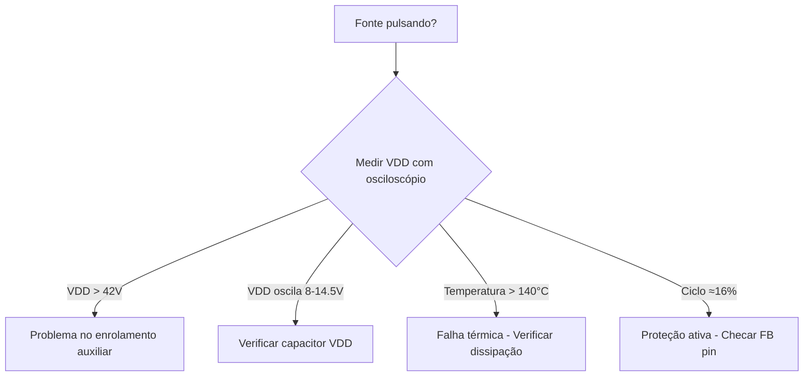
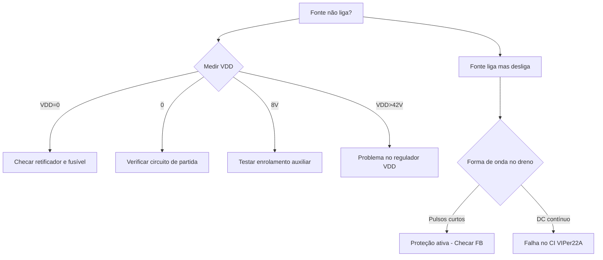

# Análise de Erros em Fontes Chaveadas Flyback com VIPer22A: Integrando o Datasheet ao Fluxograma de Diagnóstico

## Análise Aprimorada com Base no Datasheet VIPer22A-E

O datasheet do **VIPer22A** (Doc ID 12050 Rev 2) fornece informações críticas que complementam os fluxogramas de manutenção, permitindo uma análise mais precisa das falhas. A seguir, são integrados **parâmetros técnicos do datasheet** às **técnicas práticas de diagnóstico**.

---

### 1. Problemas de Partida  
**(Páginas 7-8 do fluxograma × Seção 4.4 do datasheet)**

#### Parâmetros-chave do datasheet:
| Parâmetro | Descrição | Valor Típico |
|-----------|-----------|--------------|
| VDDon     | Tensão mínima para iniciar operação | 14.5V |
| VDDoff    | Limiar de desligamento por subtensão | 8V |
| IDDch     | Corrente de carga inicial do capacitor VDD | 1mA |

#### Árvore de decisão ampliada:

- **Se VDD < 8V:**
  - Verificar resistor de partida (`Rstart`) e capacitor `Cvdd` (recomenda-se `Cvdd ≥ 10µF`)
  - Checar diodo do enrolamento auxiliar (deve suportar >42V)
  - Medir corrente de partida (ideal ≈1mA com VDS >100V)

- **Se VDD oscila entre 8-14.5V:**
  - Falha no enrolamento auxiliar (verificar indutância e acoplamento)
  - Capacitor `VDD` com ESR alto (substituir por capacitor de qualidade)

---

### 2. Modo Restart  
**(Página 6 do fluxograma × Seção 4.5 do datasheet)**

#### Novos critérios de análise:

| Parâmetro | Descrição | Valor Típico |
|----------|------------|---------------|
| VDDovp   | Limiar de proteção contra sobretensão | 42V |
| DRST     | Ciclo de trabalho no modo restart | 16% |
| TSD      | Proteção térmica | 140–170°C |

#### Procedimento expandido:



---

### 3. Malha de Feedback  
**(Página 11 do fluxograma × Seção 4.3 do datasheet)**

#### Equações críticas do datasheet:

Corrente de dreno controlada:
```
I_D = G_ID × (0.23V/R_2 - I_FB)
```
Onde:
- `G_ID = 560` (típico)
- `R_2 = 230Ω`

Limite de corrente (`FB pin = 0V`):
- `I_Dlim = 0.7A` (típico)

#### Teste aprimorado do TL431:

- Injetar tensão variável na saída (23V a 25V conforme fluxograma)
- Monitorar `V_FB` (deve variar entre 0–1V)
- Se `I_FB > 0.9mA (IFBsd)` → CI entra em proteção

---

### 4. Proteções OVP/UVP  
**(Página 16 do fluxograma × Tabela 5 do datasheet)**

#### Tabela de referência rápida:

| Proteção | Parâmetro | Valor Típico | Ação Corretiva |
|---------|-----------|---------------|----------------|
| OVP     | VDDovp    | 42V           | Verificar enrolamento auxiliar |
| UVP     | VDDoff    | 8V            | Checar circuito de partida |
| OCP     | IDlim     | 0.7A          | Medir resistor de sensing |
| OTP     | TSD       | 170°C         | Melhorar dissipação térmica |

---

### 5. Análise Térmica  
**(Seção 1.2 do datasheet)**

#### Dados térmicos importantes:

| Parâmetro | Detalhe | Valor |
|----------|---------|-------|
| RthJA (SO-8) | Resistência térmica junção-ambiente | 55°C/W |
| Potência máxima (85-265Vac) | | 7W (SO-8) |

#### Procedimento:

Calcular temperatura de junção:
```
Tj = Ta + (RthJA × Pdiss)
```

- Se `Tj > 125°C`: Reduzir `Pdiss` ou melhorar refrigeração
- Verificar `RDS(on)` do MOSFET (máx. 17Ω a 100°C)

---

## Casos Práticos com VIPer22A

### Caso 1: Fonte não mantém tensão após partida  
**Sintoma:** VDD alcança 14.5V mas cai para 8V repetidamente  
**Solução:**
- Verificar polaridade do enrolamento auxiliar
- Substituir capacitor VDD (47µF/25V recomendado)
- Checar diodo do auxiliar (velocidade reversa >100ns)

---

### Caso 2: Corrente de saída limitada  
**Sintoma:** ID < 0.4A com carga nominal  
**Diagnóstico:**
- Medir tensão no `FB pin` (deve ser ~0.5V com carga)
- Verificar optoacoplador (`CTR >100%`)
- Checar resistores do divisor de tensão no secundário

---

### Caso 3: Fonte desliga sob alta temperatura  
**Solução:**
- Medir `RDS(on)` do MOSFET integrado (≈17Ω a 100°C)
- Verificar fluxo de ar no gabinete
- Considerar usar versão **DIP-8** (`RthJA = 45°C/W`)

---

## Fluxograma de Diagnóstico Integrado



---

## Conclusão

A integração dos parâmetros técnicos do **datasheet VIPer22A-E** com os fluxogramas de manutenção permite:

- ✅ Diagnóstico mais preciso com valores de referência exatos  
- ✅ Compreensão dos limiares de proteção (OVP, UVP, OCP)  
- ✅ Análise quantitativa do comportamento da fonte  
- ✅ Seleção adequada de componentes para reparo  

### Recomendações para manutenção eficiente:
- Sempre consultar a **Tabela 4 do datasheet** (parâmetros elétricos)
- Verificar as condições **térmicas**
- Usar **osciloscópio** para analisar formas de onda críticas (`VDD`, dreno, `FB`)

