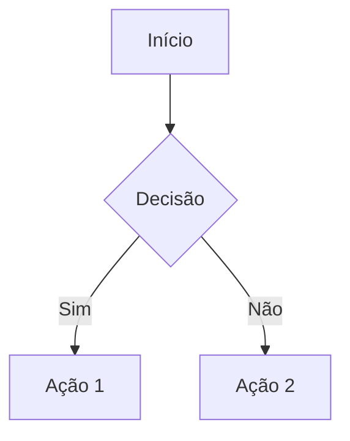
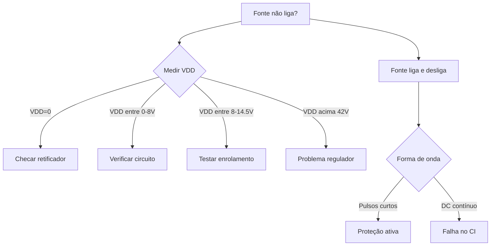

# Teste de Diagrama Mermaid

Este é um teste simples para verificar a renderização de diagramas Mermaid.

## Diagrama de Teste

```mermaid
flowchart TD
    A[Início] --> B{Decisão}
    B -->|Sim| C[Ação 1]
    B -->|Não| D[Ação 2]
```

## Diagrama do Fluxograma de Diagnóstico

```mermaid
flowchart TD
    A["Fonte não liga?"] --> B{"Medir VDD"}
    B -->|"VDD=0"| C["Checar retificador"]
    B -->|"VDD entre 0-8V"| D["Verificar circuito"]
    B -->|"VDD entre 8-14.5V"| E["Testar enrolamento"]
    B -->|"VDD acima 42V"| F["Problema regulador"]
    A --> G["Fonte liga e desliga"]
    G --> H{"Forma de onda"}
    H -->|"Pulsos curtos"| I["Proteção ativa"]
    H -->|"DC contínuo"| J["Falha no CI"]
```
